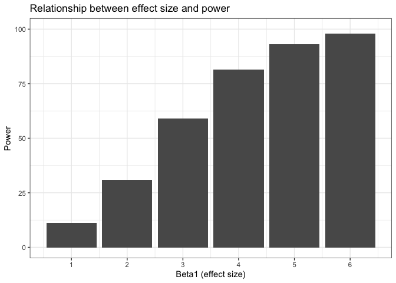

Homework 5
================
Jessica Lavery
Due 11/11/2019

## Problem 1

``` r
# load iris dataset from tidyverse package and introduce missing values
iris_with_missing = iris %>% 
  map_df(~replace(.x, sample(1:150, 20), NA)) %>%
  mutate(Species = as.character(Species))

# write a function to replace missing values per pre-defined rules
# numeric variables, fill in missing with the mean of non-missing

# create output vector to store result of function
output <- vector("list", length = ncol(iris_with_missing))

replace_missing <- function(x) {
  if (is.numeric(x)) {
    replace_na(x, mean(x, na.rm = TRUE))
    
  }  else if (is.character(x)) {
    replace_na(x, "virginica")
  }
}

# use map to apply function over all colums of iris_with_missing
output = map(iris_with_missing, replace_missing)

# look at output
# output
```

## Problem 2

## Problem 3

``` r
# simulate the regression with n = 30, beta0 = 2, sigma2 = 50
sim_regression <- function(beta_1_input) {
  # set design elements
  sim_data <- tibble(x1 = rnorm(30, 0, 1),
                   beta_0 = 2,
                   sigma_sq = 50,
                   beta_1 = beta_1_input,
                   y = beta_0 + beta_1*x1 + rnorm(30, 0, sqrt(sigma_sq)))
  
  ls_fit = lm(y ~ x1, data = sim_data)
  
  # save beta1 and p-value
  model_output <- broom::tidy(ls_fit) %>% 
    janitor::clean_names() %>% 
    filter(term == "x1") %>%
    select(estimate, p_value)
}

# run 10,000 times and aggregate results for beta1 = 0
beta1_0 <- rerun(1000, sim_regression(beta_1_input = 0)) %>% 
  bind_rows()

# view results for beta1 = 0
head(beta1_0)
```

    ## # A tibble: 6 x 2
    ##   estimate  p_value
    ##      <dbl>    <dbl>
    ## 1    2.02  0.207   
    ## 2    1.23  0.182   
    ## 3    0.603 0.606   
    ## 4    3.03  0.000149
    ## 5   -1.19  0.471   
    ## 6   -1.49  0.219

We can see from the below figure that as the effect size increases,
power also increases.

``` r
# now repeat for beta1 = {1, 2, 3, 4, 5, 6} using nesting
sim_6betas <- tibble(beta1 = c(1, 2, 3, 4, 5, 6)) %>% 
  mutate(output = map(.x = beta1, ~rerun(1000, sim_regression(beta_1_input = .x))),
         bind_output = map(output, bind_rows)) %>% 
  select(-output) %>%
  unnest(cols = c(bind_output)) %>% 
  mutate(sig = p_value < 0.05)

# plot power by effect size
sim_6betas %>% 
  group_by(beta1) %>% 
  summarize(pct_sig = 100*mean(sig)) %>% 
  ggplot(aes(x = beta1, y = pct_sig)) +
  geom_bar(stat = "identity") +
  labs(title = "Relationship between effect size and power",
       y = "Power",
       x = "Beta1 (effect size)") +
  scale_y_continuous(lim = c(0, 100)) +
  scale_x_continuous(breaks = seq(0, 6, 1))
```

<!-- -->

``` r
# plot the average estimate of beta1 by the true value of beta1
avg_beta1 <- sim_6betas %>% 
  group_by(beta1) %>% 
  summarize(avg_beta1 = mean(estimate)) %>% 
  rename(true_beta1 = beta1) 

avg_beta1_sig <- sim_6betas %>% 
  filter(sig == 1) %>% 
  group_by(beta1) %>% 
  summarize(avg_beta1 = mean(estimate)) %>% 
  rename(true_beta1 = beta1) 

ggplot(mapping = aes(x = true_beta1, y = avg_beta1)) + 
  geom_line(data = avg_beta1) +
  geom_line(data = avg_beta1_sig, color = "blue") +
  labs(title = "Relationship between true and average estimated effect size",
       y = "Average effect size",
       x = "True effect size") +
  scale_x_continuous(breaks = seq(0, 6, 1))
```

<!-- -->
